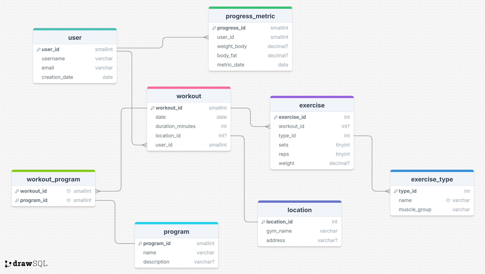

# Dog Show

My project models data for a gym workout and progress tracking application. It includes tables for users, workouts, exercises, gym locations, workout programs, and user progress metrics.



## Query I thought it did well on

**Question**: Which users haven't logged any progress metrics?

**GPT SQL Response**:

```sql
SELECT u.user_id, u.username
FROM users u
LEFT JOIN progress_metric pm ON u.user_id = pm.user_id
WHERE pm.progress_id IS NULL;
```

**Friendly Response**: The user who hasn't logged any progress metrics is Dave.

## Question that it tripped up on

It generated the SQL part almost right, but didn't always give a truly meaningful friendly answer.
For example, I wanted to know if there are any users with progress data who haven't worked out recently,
but sometimes the friendly response was confusing or didn't really answer the intent of the question.

Question: Are there any users with progress data who haven't worked out recently?

**GPT SQL Response**:

```sql
SELECT u.user_id, u.username
FROM users u
LEFT JOIN workout w ON u.user_id = w.user_id
LEFT JOIN progress_metric pm ON u.user_id = pm.user_id
WHERE pm.progress_id IS NOT NULL AND (w.workout_id IS NULL OR w.workout_date < pm.metric_date);
```

SQL Result: [ ('bob',) ]

**Friendly response**: Yes, Bob hasn't worked out recently.

Sometimes the SQL logic worked, but the summary language was generic or unclear, especially when the intent of “recently” wasn't explicit.

## Zero-shot

Only the schema and a generic instruction. Worked well for basic aggregations.

**Question (Zero-shot)**: What are the top 3 most-used gym locations?

SQL Result is just "IDs": [('Peak Performance', 3), ('Downtown Gym', 3)]

**Friendly response**: The top gym locations are Peak Performance and Downtown Gym, both with 3 mentions.

## Few-shot

Provided an example SQL and answer in the prompt. GPT closely mimicked the example structure and performed reliably on similar questions.

**Question (Few-shot)**: Which users have multiple progress metric entries?

SQL Result is just "IDs": [(2, 'bob')]

**Friendly response**: Bob has multiple progress metric entries.

## Chain-of-thought

Added a "think step by step" preamble to help GPT reason through more complex queries.

**Question (chain-of-thought)**: Which users have done the most workouts?

SQL Result is just "IDs": [(1, 'alice', 3), (2, 'bob', 3), (3, 'carol', 1)]

**Friendly response**: Alice and Bob have done the most workouts with 3 each.

## Single-domain/double-shot

Included a very specific question and answer as an example. GPT was highly accurate on that question but less so on unrelated ones.

**Question (single-domain)**: Which users have multiple progress metric entries?

SQL Result is just "IDs": [(2, 'bob')]

**Friendly response**: User \"bob\" has multiple progress metric entries.

## Self-asking

Broke down the query in the prompt into sub-questions to guide GPT.

**Question (self-asking)**: Which users haven't logged any progress metrics?

SQL Result is just "IDs": [(4, 'dave')]

**Friendly response**: User dave hasn't logged any progress metrics.

## Conclusion

My findings is that for basic aggregations and joins GPT did well at generating working SQLite queries and answers.
However, for more ambiguous questions or those requiring context (like what "recently" means), the responses can be vague or misleading. Prompting strategies included clear step-by-step reasoning or examples to improve accuracy and reliability.
